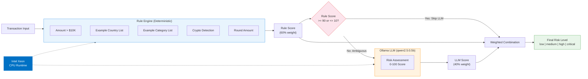

# Build a hybrid fraud-scoring demo with explainable AI

Learn a rule-first, AI-second scoring pattern that combines transparent example signals with conditional LLM assessment.

## Table of Contents

- [Overview](#overview)
- [Who is this for](#who-is-this-for)
- [Example use cases](#example-use-cases)
- [Detailed description](#detailed-description)
  - [Architecture diagrams](#architecture-diagrams)
- [See it in action](#see-it-in-action)
- [What this teaches](#what-this-teaches)
- [What this is not](#what-this-is-not)
- [Adapt the pattern](#adapt-the-pattern)
- [Requirements](#requirements)
  - [Minimum hardware requirements](#minimum-hardware-requirements)
  - [Minimum software requirements](#minimum-software-requirements)
  - [Required user permissions](#required-user-permissions)
- [Deploy](#deploy)
  - [Prerequisites](#prerequisites)
  - [Installation](#installation)
  - [Validating the deployment](#validating-the-deployment)
  - [Delete](#delete)
- [Repository structure](#repository-structure)
- [References](#references)
- [Tags](#tags)

## Overview

This quickstart demonstrates a hybrid scoring pipeline: deterministic example rules handle obvious cases, while an LLM assesses ambiguous transactions. The API exposes each rule signal, whether the model ran, and how the final score was combined. It is intentionally compact so you can deploy it quickly, understand the complete flow, and replace the example logic with signals from your own application -- no GPU infrastructure required.

## Who is this for

- **Application developers** learning how to combine deterministic logic with model inference
- **Solution architects** evaluating rule-first, AI-second application patterns
- **Data and risk teams** prototyping explainable scoring workflows before adding domain data and validation

## Example use cases

- **Transaction review prototypes** -- combine business rules with contextual model assessment
- **Insurance claim triage** -- replace the example transaction fields with claim attributes and known indicators
- **Security event prioritization** -- skip model calls for clear allow/deny cases and inspect ambiguous events
- **Content or account risk scoring** -- reuse the conditional inference pattern with your own rules and model

## Detailed description

Many scoring applications balance two useful techniques: deterministic rules are transparent and inexpensive, while models can assess context that is awkward to encode as fixed conditions. This quickstart makes that tradeoff visible with a small hybrid architecture.

The scorer runs every transaction through an example rule engine first. Its high-amount, country, category, crypto, and round-amount checks are deliberately simple teaching heuristics -- they are not regulatory rules, FATF classifications, or a trained fraud model. Each match produces a visible signal that shows how deterministic evidence can be carried into a combined response.

A conditional pipeline then decides whether model review is needed. When the example rule score is at a configured extreme, the model call is skipped. Ambiguous transactions receive a structured model score, and the final result combines both sources using configurable weights. Actual skip rate, quality, cost, and latency depend on the rules, model, and data you substitute.

The included model path runs on standard CPU hardware without a GPU. The actual share of requests that skip the model, and any resulting resource savings, depend on the rules and data used in an adaptation.

### Architecture diagrams



## See it in action


The Gradio UI provides three tabs: single transaction scoring with risk level badges and signal breakdowns, batch analysis for bulk transaction processing, and a statistics dashboard showing LLM calls, skips, failures, and latency metrics. Simulated responses are labeled `demo-simulator`.

## What this teaches

- How to keep deterministic rule signals visible in an AI-assisted response
- How to skip model inference for high-confidence rule outcomes
- How to call an OpenAI-compatible model endpoint with structured JSON output
- How to expose demo/live mode, readiness, scoring statistics, and graceful per-request fallback
- How to package the same small service for local Compose and OpenShift with Helm

## What this is not

- A trained or validated fraud-detection model
- Regulatory, AML, sanctions, or compliance advice
- A production decision system or substitute for human review
- Evidence that the included example rules or weights perform well on real transactions

Use synthetic data with the quickstart. Before adapting it to real decisions, replace the example policy data, validate outcomes on representative labeled data, and add the security, monitoring, and governance controls required by your application.

## Adapt the pattern

1. Replace `HIGH_RISK_COUNTRIES`, `HIGH_RISK_CATEGORIES`, and `RuleEngine.score()` in `src/scorer.py` with sourced signals from your domain.
2. Change `TransactionRequest` and the matching OpenAPI schema to accept the fields your application actually uses.
3. Tune `RULE_WEIGHT`, `LLM_WEIGHT`, and the skip thresholds with representative evaluation data.
4. Update the structured prompt and test it against your chosen OpenAI-compatible model.
5. Add labeled integration cases that compare rules-only and hybrid outcomes before using the result outside a demo.

## Intel Hardware

This quickstart runs on **Intel Xeon** processors. All inference is CPU-based with no GPU required.

| Component | Intel Hardware |
|-----------|---------------|
| **Rule Engine** | Deterministic scoring on Intel Xeon CPU |
| **LLM Inference** | qwen2.5:0.5b on Intel Xeon with Ollama |
| **Infrastructure** | Red Hat OpenShift on Intel Xeon worker nodes |

> **Powered by Intel** -- This quickstart is part of the Red Hat + Intel AI Inference Partnership.

## Requirements

### Minimum hardware requirements

- 4 CPU cores (Intel Xeon recommended)
- 8 GiB memory
- 10 GiB storage

### Minimum software requirements

- Red Hat OpenShift 4.14 or later
- Helm 3.12 or later
- `oc` CLI tool
- Podman or Docker (for local development)
- Python 3.10 or later (for `demo.sh` or direct local execution)

### Required user permissions

This quickstart can be deployed by a regular user with namespace-level permissions.

## Deploy

### Prerequisites

- Access to a Red Hat OpenShift cluster (or local Podman/Docker for development)
- `oc` CLI authenticated to your cluster
- Helm 3.12+ installed
- (Optional) Ollama installed locally for live LLM scoring

### Installation

**Fastest path: run the self-contained local demo**

The launcher creates a virtual environment, uses Ollama when it is already available, and otherwise starts the clearly labeled simulator. Press Ctrl+C to stop both services.

```bash
git clone https://github.com/rh-ai-quickstart/hybrid-fraud-detection.git
cd hybrid-fraud-detection
./demo.sh
# Open http://localhost:7860
```

**OpenShift deployment**

1. Clone the repository if you have not already:

```bash
git clone https://github.com/rh-ai-quickstart/hybrid-fraud-detection.git
cd hybrid-fraud-detection
```

2. Create an OpenShift project:

```bash
oc new-project hybrid-fraud-detection
```

3. Install using Helm:

**Option A: Use your own model (MaaS - Model as a Service)**

```bash
# Create the bearer token as a Kubernetes Secret. Omit this step and the
# existingSecret value when your endpoint does not require authentication.
oc create secret generic fraud-model-credentials \
  --from-literal=api-key='<api-key>'

helm install hybrid-fraud-detection chart/ \
  --set model.name=<model-name> \
  --set model.endpoint=<endpoint-url-or-v1-url> \
  --set model.existingSecret=fraud-model-credentials
```

The endpoint must expose the OpenAI-compatible `/v1/models` and `/v1/chat/completions` APIs. The scorer accepts either the provider root URL or a URL ending in `/v1`.

**Option B: Deploy in demo mode (no external model required)**

```bash
helm install hybrid-fraud-detection chart/
```

The scorer runs in demo mode with simulated LLM responses when no `MODEL_ENDPOINT` is configured.

**Local development with Docker Compose (recommended):**

```bash
# Start Ollama + scorer with real LLM inference
docker compose up -d

# Include the Gradio UI at http://localhost:7860
docker compose --profile ui up -d

# The ollama-pull service downloads qwen2.5:0.5b automatically.
# Wait for the model pull to complete, then score a transaction:
curl -s http://localhost:8000/api/v1/score \
  -H "Content-Type: application/json" \
  -d '{"amount": 15000, "country": "NG", "category": "wire_transfer"}' | python3 -m json.tool
```

To run in demo mode instead (no Ollama required):

```bash
DEMO_MODE=true docker compose up --no-deps -d scorer
```

**Launch the Gradio UI:**

```bash
pip install -r src/requirements.txt
SCORER_URL=http://localhost:8000 python src/ui.py
# Open http://localhost:7860
```

### Validating the deployment

```bash
# Check pod status
oc get pods

# Get the application URL
echo "https://$(oc get route hybrid-fraud-detection-scorer -o jsonpath='{.spec.host}')"

# Run Helm test
helm test hybrid-fraud-detection

# Check health endpoint
curl -s https://$(oc get route hybrid-fraud-detection-scorer -o jsonpath='{.spec.host}')/health

# Check model/demo readiness
curl -s https://$(oc get route hybrid-fraud-detection-scorer -o jsonpath='{.spec.host}')/ready

# Run unit tests locally
make test-unit
```

### Delete

```bash
helm uninstall hybrid-fraud-detection
oc delete project hybrid-fraud-detection
```

## Repository structure

```
.
├── .env.example              # Environment variable template
├── .github/
│   └── workflows/
│       └── ci.yaml           # GitHub Actions CI pipeline
├── chart/                    # Helm chart for OpenShift deployment
│   ├── Chart.yaml
│   ├── values.yaml
│   └── templates/
│       ├── deployment.yaml
│       ├── service.yaml
│       ├── route.yaml
│       └── test-scorer.yaml
├── contracts/                # API contracts (OpenAPI)
│   └── openapi/
│       └── fraud-detection.yaml
├── docs/
│   └── images/
│       ├── architecture.png  # Architecture diagram
│       └── screenshot.png    # UI screenshot
├── src/                      # Application source code
│   ├── scorer.py             # FastAPI app: rule engine + LLM + hybrid scorer
│   ├── ui.py                 # Gradio UI: scoring interface
│   ├── Containerfile
│   └── requirements.txt
├── tests/                    # CDD -> TDD -> EDD validation
│   ├── contracts/            # Stage 0: Contract compliance
│   ├── unit/                 # Stage 2: Technique validation
│   │   └── test_fraud_scoring.py
│   ├── integration/          # Stage 3: End-to-end API flow
│   ├── benchmarks/           # Stage 4: Demo performance guards
│   └── publication/          # Stage 5: README quality
├── docker-compose.yml        # Local dev stack (Ollama + scorer)
├── Makefile                  # Test targets: make test-all
├── LICENSE
└── README.md
```

## References

- [Intel Xeon Processors for Financial Workloads](https://www.intel.com/content/www/us/en/financial-services-it/overview.html) -- CPU-optimized inference for financial services
- [Red Hat OpenShift AI](https://www.redhat.com/en/technologies/cloud-computing/openshift/openshift-ai)
- [FastAPI Documentation](https://fastapi.tiangolo.com/)
- [Ollama](https://ollama.com/) -- local LLM serving with OpenAI-compatible API
- [Gradio](https://www.gradio.app/) -- rapid ML demo interfaces

## Tags

- **Title:** Build a hybrid fraud-scoring demo with explainable AI
- **Description:** Learn a rule-first, AI-second scoring pattern with transparent example signals and conditional LLM assessment.
- **Industry:** Banking and securities
- **Product:** Red Hat OpenShift AI
- **Use case:** AI inference
- **Partner:** Intel
- **Contributor org:** Red Hat
