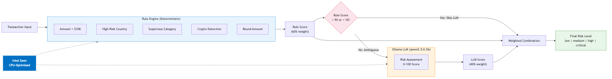
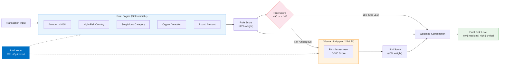
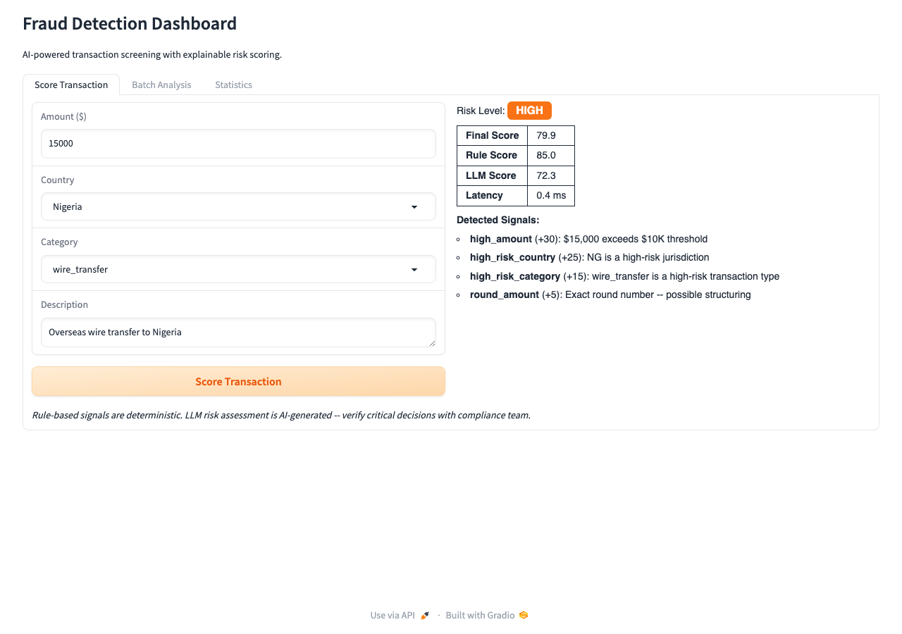

# Detect financial fraud with explainable AI scoring

Catch fraud faster with AI scoring that auditors and regulators can trust, combining rules and LLM reasoning.

## Table of Contents

- [Overview](#overview)
- [Who is this for](#who-is-this-for)
- [Example use cases](#example-use-cases)
- [Detailed description](#detailed-description)
  - [Architecture diagrams](#architecture-diagrams)
- [See it in action](#see-it-in-action)
- [Requirements](#requirements)
  - [Minimum hardware requirements](#minimum-hardware-requirements)
  - [Minimum software requirements](#minimum-software-requirements)
  - [Required user permissions](#required-user-permissions)
- [Deploy](#deploy)
  - [Prerequisites](#prerequisites)
  - [Installation](#installation)
  - [Validating the deployment](#validating-the-deployment)
  - [Delete](#delete)
- [Repository structure](#repository-structure)
- [References](#references)
- [Tags](#tags)

## Overview

Financial institutions need to screen transactions for fraud in real time while meeting regulatory requirements for explainability. Pure machine-learning approaches produce opaque scores that compliance teams cannot audit, while pure rule engines miss novel fraud patterns. This quickstart deploys a hybrid scoring pipeline that combines both approaches, giving analysts deterministic signal explanations alongside AI risk assessment -- no GPU infrastructure required.

## Who is this for

- **Compliance officers** evaluating AI-assisted fraud detection for regulatory readiness
- **Financial services architects** designing transaction monitoring pipelines that balance speed and explainability
- **Risk analysts** building explainable scoring models that combine deterministic rules with LLM reasoning

## Example use cases

- **AML transaction monitoring for banks** -- screen wire transfers and cross-border payments against FATF risk indicators with deterministic audit trails
- **Real-time payment fraud screening** -- score card-not-present and instant payment transactions at sub-second latency using conditional LLM skip
- **Insurance claim fraud detection** -- flag suspicious claims using rule-based pattern matching augmented by LLM contextual reasoning
- **Cryptocurrency exchange compliance** -- detect structuring, high-risk jurisdictions, and unusual transaction patterns for regulatory reporting

## Detailed description

Fraud detection at scale presents a fundamental tension: rule-based systems provide the auditability that regulators demand, but they cannot adapt to emerging fraud patterns. Large language models can reason about novel transaction patterns, but their outputs lack the deterministic traceability that banking compliance requires. This quickstart resolves that tension with a hybrid scoring architecture.

The hybrid scorer runs every transaction through a deterministic rule engine first. The rule engine checks for high-value amounts (above $10,000), high-risk jurisdictions, suspicious transaction categories (wire transfers, cryptocurrency, gambling), round-amount structuring patterns, and other configurable signals. Each detected signal produces an auditable trail that compliance teams can review and explain to regulators.

A conditional pipeline then decides whether AI review is needed. When the rule engine is confident -- clearly fraudulent or clearly legitimate -- the AI call is skipped entirely, reducing processing costs by an estimated 60-70%. For ambiguous transactions, the AI provides an independent risk assessment. The final score combines both sources, giving compliance teams a result they can decompose and explain at every level.

This architecture keeps infrastructure simple. The rule engine handles the majority of transactions at minimal cost, and AI inference runs on standard CPU hardware without GPU dependencies -- reducing both capital expense and operational complexity for financial institutions.

### Architecture diagrams





## See it in action



The Gradio UI provides three tabs: single transaction scoring with risk level badges and signal breakdowns, batch analysis for bulk transaction processing, and a statistics dashboard showing LLM skip rates and latency metrics.

## Requirements

### Minimum hardware requirements

- 4 CPU cores (Intel Xeon recommended)
- 8 GiB memory
- 10 GiB storage

### Minimum software requirements

- Red Hat OpenShift 4.14 or later
- Helm 3.12 or later
- `oc` CLI tool
- Podman or Docker (for local development)

### Required user permissions

This quickstart can be deployed by a regular user with namespace-level permissions.

## Deploy

### Prerequisites

- Access to a Red Hat OpenShift cluster (or local Podman/Docker for development)
- `oc` CLI authenticated to your cluster
- Helm 3.12+ installed
- (Optional) Ollama installed locally for live LLM scoring

### Installation

1. Clone the repository:

```bash
git clone https://github.com/rh-ai-quickstart/hybrid-fraud-detection.git
cd hybrid-fraud-detection
```

2. Create an OpenShift project:

```bash
oc new-project hybrid-fraud-detection
```

3. Install using Helm:

**Option A: Use your own model (MaaS - Model as a Service)**

```bash
helm install hybrid-fraud-detection chart/ \
  --set model.name=<model-name> \
  --set model.endpoint=<endpoint-url> \
  --set model.api_key=<api-key>
```

**Option B: Deploy in demo mode (no external model required)**

```bash
helm install hybrid-fraud-detection chart/
```

The scorer runs in demo mode with simulated LLM responses when no `MODEL_ENDPOINT` is configured.

**Local development with Docker Compose (recommended):**

```bash
# Start Ollama + scorer with real LLM inference
docker compose up -d

# The ollama-pull service downloads qwen2.5:0.5b automatically.
# Wait for the model pull to complete, then score a transaction:
curl -s http://localhost:8000/api/v1/score \
  -H "Content-Type: application/json" \
  -d '{"amount": 15000, "country": "NG", "category": "wire_transfer"}' | python3 -m json.tool
```

To run in demo mode instead (no Ollama required):

```bash
DEMO_MODE=true docker compose up -d scorer
```

**Launch the Gradio UI:**

```bash
pip install -r src/requirements.txt
SCORER_URL=http://localhost:8000 python src/ui.py
# Open http://localhost:7860
```

### Validating the deployment

```bash
# Check pod status
oc get pods

# Get the application URL
echo "https://$(oc get route hybrid-fraud-detection-scorer -o jsonpath='{.spec.host}')"

# Run Helm test
helm test hybrid-fraud-detection

# Check health endpoint
curl -s https://$(oc get route hybrid-fraud-detection-scorer -o jsonpath='{.spec.host}')/health

# Run unit tests locally
make test-unit
```

### Delete

```bash
helm uninstall hybrid-fraud-detection
oc delete project hybrid-fraud-detection
```

## Repository structure

```
.
├── .env.example              # Environment variable template
├── .github/
│   └── workflows/
│       └── ci.yaml           # GitHub Actions CI pipeline
├── chart/                    # Helm chart for OpenShift deployment
│   ├── Chart.yaml
│   ├── values.yaml
│   └── templates/
│       ├── deployment.yaml
│       ├── service.yaml
│       ├── route.yaml
│       └── test-model-access.yaml
├── contracts/                # API contracts (OpenAPI)
│   └── openapi/
│       └── fraud-detection.yaml
├── docs/
│   └── images/
│       ├── architecture.png  # Architecture diagram
│       └── screenshot.png    # UI screenshot
├── src/                      # Application source code
│   ├── scorer.py             # FastAPI app: rule engine + LLM + hybrid scorer
│   ├── ui.py                 # Gradio UI: scoring interface
│   ├── Containerfile
│   └── requirements.txt
├── tests/                    # CDD -> TDD -> EDD validation
│   ├── contracts/            # Stage 0: Contract compliance
│   ├── unit/                 # Stage 2: Technique validation
│   │   └── test_fraud_scoring.py
│   ├── integration/          # Stage 3: End-to-end flow
│   ├── benchmarks/           # Stage 4: Performance validation
│   └── publication/          # Stage 5: README quality
├── docker-compose.yml        # Local dev stack (Ollama + scorer)
├── Makefile                  # Test targets: make test-all
├── LICENSE
└── README.md
```

## References

- [Financial Action Task Force (FATF) AML/CFT Guidance](https://www.fatf-gafi.org/en/topics/fatf-recommendations.html) -- international standards for anti-money laundering and counter-terrorist financing
- [LangGraph Conditional Edges](https://langchain-ai.github.io/langgraph/concepts/low_level/#conditional-edges) -- pattern for conditional routing in AI pipelines
- [Intel Xeon Processors for Financial Workloads](https://www.intel.com/content/www/us/en/financial-services-it/overview.html) -- CPU-optimized inference for financial services
- [Quarkus Native Compilation](https://quarkus.io/guides/building-native-image) -- native compilation for low-latency microservices
- [Red Hat OpenShift AI](https://www.redhat.com/en/technologies/cloud-computing/openshift/openshift-ai)
- [FastAPI Documentation](https://fastapi.tiangolo.com/)
- [Ollama](https://ollama.com/) -- local LLM serving with OpenAI-compatible API
- [Gradio](https://www.gradio.app/) -- rapid ML demo interfaces

## Tags

- **Title:** Detect financial fraud with explainable AI scoring
- **Description:** Catch fraud faster with AI scoring that auditors and regulators can trust, combining rules and LLM reasoning.
- **Industry:** Banking and securities
- **Product:** Red Hat OpenShift AI
- **Use case:** AI inference
- **Partner:** Intel
- **Contributor org:** Red Hat
